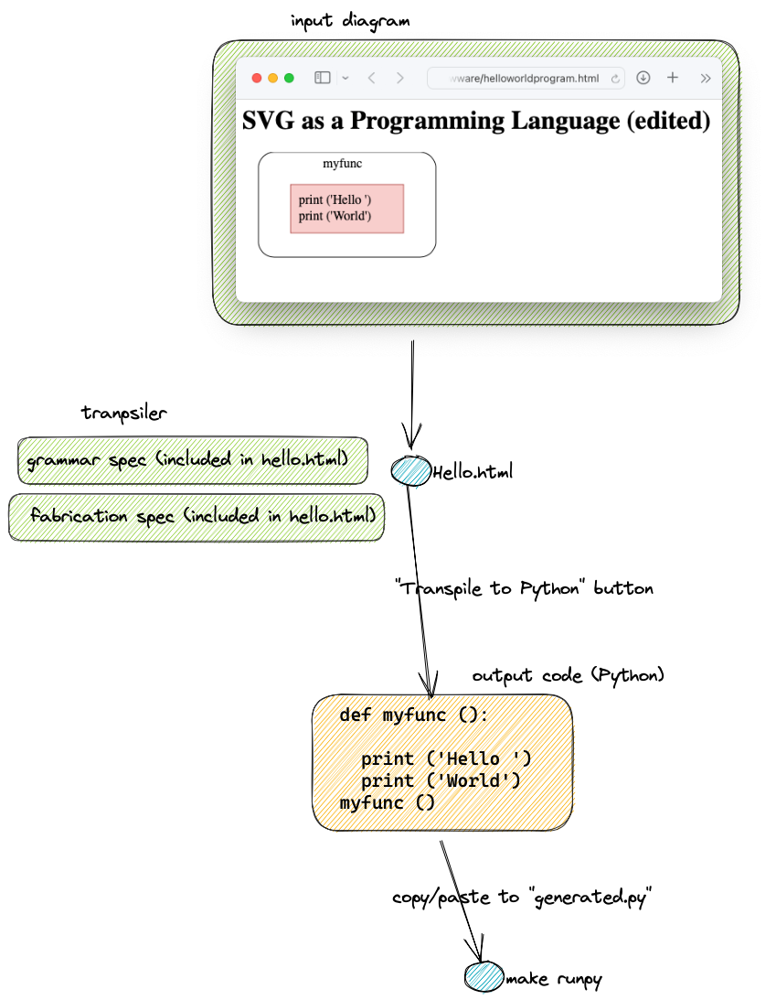

A VERY simple example of compiling a diagram to executable code.

In this case, we take a simple SVG drawing and compile it to Python.

To run:
1. $ make install
2. load 'hello.html' into a browser (if using Safari, select View>>Text Encoding>>UTF-8)
3. push the "Transpile to Common Lisp" button
4. copy/paste the generated Lisp code into 'generated.lisp' (overwriting the previous content, if any)
5. $ make runcl

caveat: Yes, this is a silly, small example, but, hopefully demonstrates how this can be done with existing tools.  The interesting stuff begins to happen when you hook rectangles up with 0D (0D === "Concurrency - The Good Parts").

The stuff in the old-lace boxes is FYI.  Look at hello.html to see how I put it there.

# Indenter.js
Python has a syntax that uses indentation instead of brackets.  

This kind of syntax is not machine-writable.

So, we emit code in a pseudo-syntax:
- `(-` denotes and new scope block, like `{` in other languages
- `-)` denotes the end of a scope block, like `}` in other languages
- This syntax is chosen so that `emacs` Lisp-mode can be used to view intermediate results during bootstrap.

The pseudo-code is processed by `indenter.js` to produce Python with the correct indentation.

The indenter skips all other code.  The indenter always runs, even if no pseudo-indentation syntax is used.  

This means that we could use indentation pseudo-syntax for other languages, to prettify the result.